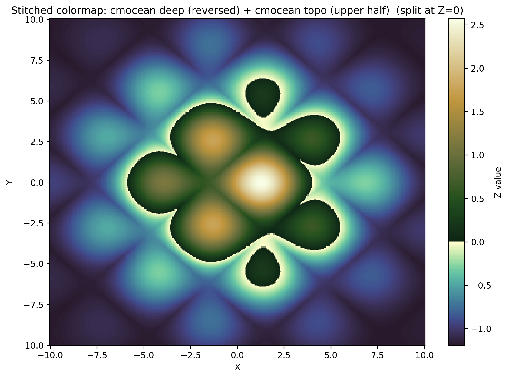
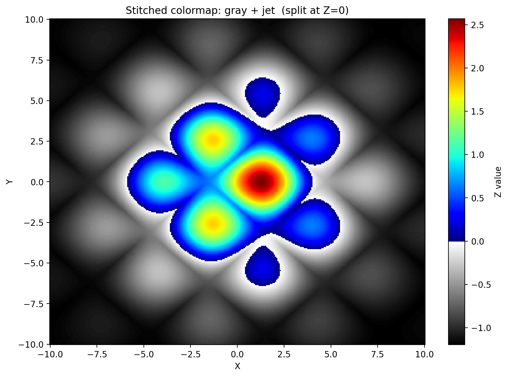

# 🎨 Stitched Colorbars

> Seamlessly combine two colormaps into one — for topography, thresholds, or any visualization that needs a split color scheme.

[](https://www.gnu.org/licenses/gpl-3.0)
[](https://alexisgomel.com/projects)

## Overview

**Stitched Colorbars** provides a simple utility to create a new colormap by stitching two existing colormaps at a configurable split point. Available for both **MATLAB** and **Python** (matplotlib).

### Why?

Standard colormaps apply a single gradient across an entire data range. But many datasets have a meaningful boundary — sea level in topography, a pass/fail threshold, or a transition between regimes. Stitching colormaps lets you:

- Use **distinct color schemes** above and below a critical value
- Combine any two colormaps from libraries like [cmocean](https://matplotlib.org/cmocean/), matplotlib, or custom palettes
- Control the **exact split point** to match your data's natural boundary

## Examples

### Topography

_Using `cmocean('deep')` below sea level and `cmocean('topo')` (upper half) above._



### Threshold-based coloring

_Using `gray` and `jet` to distinguish features above and below a threshold._



---

## Getting Started

### 🐍 Python

The Python implementation is located in the `python/` directory.

#### Installation

Copy the `python/stitched_colorbars/` folder into your project.

#### Usage

```python
from stitched_colorbars import stitch_colormaps
import matplotlib.pyplot as plt

# Stitch two colormaps at 40% (0.4)
# You can pass names ("Blues", "Reds") or distinct objects
combined = stitch_colormaps("Blues", "Reds", 0.4)

plt.imshow(data, cmap=combined)
```

See the full example script: [python/examples/stitched_colormaps_example.py](python/examples/stitched_colormaps_example.py)

### 📐 MATLAB

The MATLAB implementation is located in the `matlab/` directory.

#### Usage

Add the `matlab/colormaps/` folder to your path:

```matlab
addpath(genpath('matlab/colormaps'));

% Define split point (0-100)
stich_point = 40;

% Stitch two colormaps
cmap = stiched_colormap(flipud(cmocean('deep')), elevation(), stich_point);

colormap(cmap);
```

See the example script: [matlab/stiched_colormaps_example.m](matlab/stiched_colormaps_example.m)

---

## API Reference (Python)

### `stitch_colormaps(c1, c2, stich_point)`

Creates a new colormap by combining two colormaps at the given split point.

| Parameter     | Type                   | Description                                  |
| ------------- | ---------------------- | -------------------------------------------- |
| `c1`          | str / array / Colormap | First colormap (lower portion)               |
| `c2`          | str / array / Colormap | Second colormap (upper portion)              |
| `stich_point` | float (0.0–1.0)        | Split position (e.g. `0.3` = 30% c1, 70% c2) |

**Returns:** A `ListedColormap` ready to use with matplotlib.

### `interpolate_colormap(cmap, num_colors, vmin, vmax)`

Resamples a colormap to a different number of colors, optionally using only a sub-range.

| Parameter    | Type                   | Description                      |
| ------------ | ---------------------- | -------------------------------- |
| `cmap`       | str / array / Colormap | Input colormap                   |
| `num_colors` | int                    | Number of output colors          |
| `vmin`       | float (0–1)            | Start of the range (default `0`) |
| `vmax`       | float (0–1)            | End of the range (default `1`)   |

---

## Project Structure

```
├── python/
│   ├── stitched_colorbars/  # Core Python package
│   └── examples/            # Example scripts & images
│
├── matlab/
│   ├── colormaps/           # MATLAB functions
│   └── examples/            # MATLAB examples
│
└── README.md
```

## More Projects

Check out my other projects at [alexisgomel.com/projects](https://alexisgomel.com/projects).

## License

This project is licensed under the [GNU General Public License v3.0](LICENSE).
